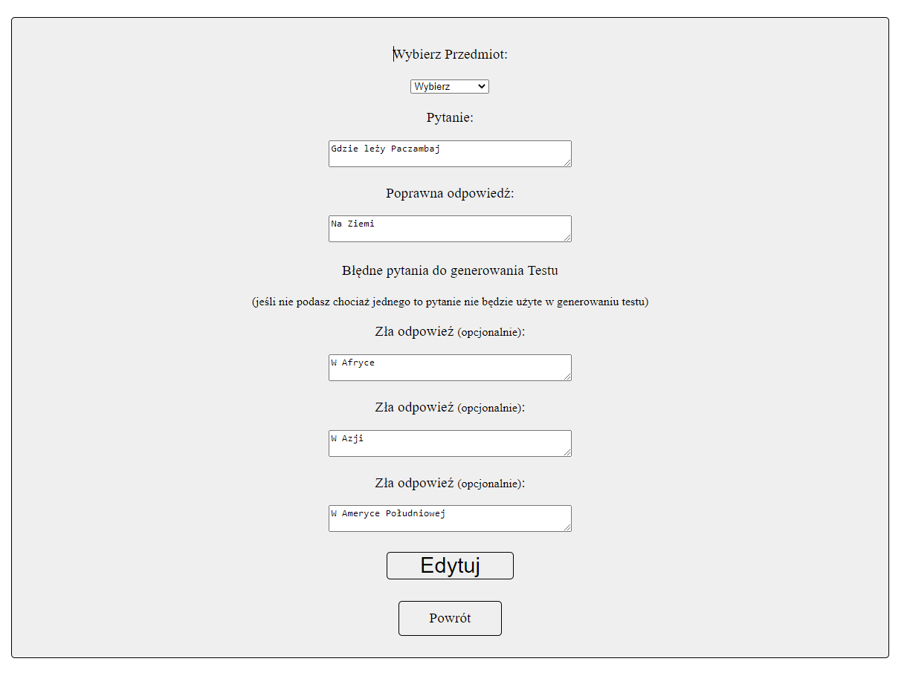

# Test Generator API Frontend
This project was create to help people to study. It is also good to make a simple quiz for fun.
this app is used in https://mpapi.networkmanager.pl

## General Information
This project was create to help study to exam in school but it is also good to did simple quiz and have fun with friends.

The purpose is fast and enjoyable study base on question and answer and solve test

I did this because someone asked me to create app to study for exam.
It is also a credit project in MegaK course.

## Available Scripts

In the project directory, you can run:

### `npm start`

Runs the app in the development mode.\
Open [http://localhost:3000](http://localhost:3000) to view it in the browser.

first to open the whole app you must to register new user and login.

On path /admin you can see a panel admin where you can delete user or update and delete some question. I intentionally did not create logic to lock the admin panel for selected persons because I want to show how it looks and works.

## Usage
This api is collaborated with TestGenerator-backend API Link here:
https://github.com/ItachiPM/TestGenerator-back

# Getting Started with Create React App
This project was bootstrapped with [Create React App](https://github.com/facebook/create-react-app).

## Views

- Login
  
- Register
  
- Menu
  
- Generate test
  
- Test setting
  
- Test view
  
- Test result
  
- Question preview for study
  
- Add question
  
- Admin panel
  
- Edit question
  

## Acknowledgements
This project was created on base knowledge gained on MegaK course.

## Contact
michal.pietraszek98@gmail.com
